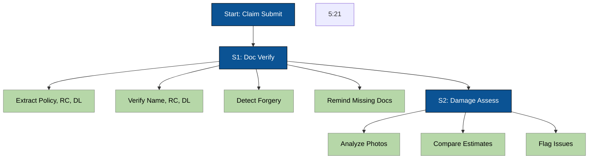


# Comprehensive Audio Processing System Documentation

This document consolidates all the information from the various markdown files in the audio processing system, providing a complete overview of the architecture, components, usage, and troubleshooting of the system.

## Table of Contents
1. [System Overview](#system-overview)
2. [Features](#features)
3. [System Architecture](#system-architecture)
4. [Core Components](#core-components)
5. [Supported Languages](#supported-languages)
6. [API Endpoints](#api-endpoints)
7. [Installation & Setup](#installation--setup)
8. [Usage Examples](#usage-examples)
9. [Audio Processing Workflow](#audio-processing-workflow)
10. [Troubleshooting](#troubleshooting)
11. [Performance Optimization](#performance-optimization)
12. [Future Improvements](#future-improvements)

## System Overview

The audio processing system is a comprehensive solution for automatic speech recognition (ASR) with support for multiple languages, including specialized models for Indian languages. The system provides high-accuracy transcription, speaker diarization, noise reduction, and visualization capabilities.

Key features:
- Multi-tier transcription using Whisper and IndicConformer models
- Support for 22 Indian languages with specialized models
- Advanced noise reduction pipeline
- Speaker diarization with visualization
- Language detection and automatic routing
- RESTful API for integration

## Features

### Multi-language Support
- Multi-language support for Indian languages (Hindi, Tamil, Telugu, Kannada, Malayalam, Marathi)
- Support for all languages supported by OpenAI Whisper, including English, Spanish, French, German, Chinese, Japanese, Korean, and 90+ more languages

### Advanced Preprocessing
- Proactive audio conversion to optimal format (16kHz mono WAV)
- Bandpass filtering to focus on speech frequencies
- Audio normalization for consistent transcription quality
- Stereo-to-mono conversion with multiple strategies
- Validation of audio compliance with transcription requirements

### Transcription Capabilities
- Chunked processing for long audio files
- Language detection using Whisper models
- Multi-tier transcription system with fallback mechanisms
- Speaker diarization to identify different speakers
- Advanced analysis (emotion, sentiment, acoustic features)

### Visualization
- Audio waveform visualization with speaker diarization
- Speaker activity timeline
- Loudness analysis overlay
- Speaking rate visualization

## System Architecture

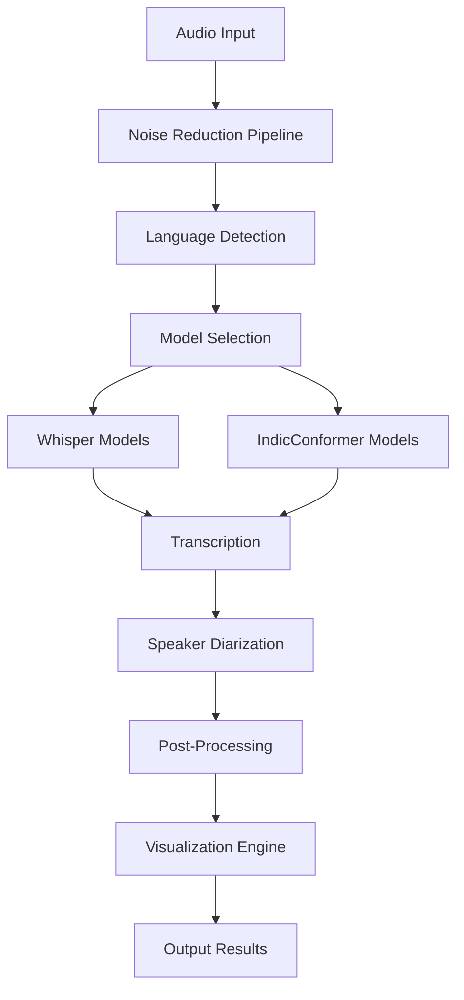

The system follows a modular architecture with the following data flow:
1. Audio input is preprocessed through noise reduction
2. Language is detected to determine the appropriate model
3. Audio is transcribed using either Whisper or IndicConformer models
4. Speaker diarization is performed to identify different speakers
5. Results are post-processed and visualized

## Core Components

### Multi-Tier Transcription System

The `MultiTierTranscriber` is the core component that orchestrates the transcription process by intelligently selecting the appropriate model based on the detected language.

#### Key Features:
- Automatic language detection and model routing
- Fallback mechanisms for error handling
- Support for both monolingual and multilingual models
- Integration with noise reduction pipeline

#### Implementation Details:
- Routes Indian languages to IndicConformer models
- Uses Whisper models for all other languages
- Implements advanced noise reduction preprocessing
- Provides detailed metadata about transcription quality

#### Code Example:
```python
from audio_processing.utils.multi_tier_transcriber import MultiTierTranscriber

# Initialize transcriber
transcriber = MultiTierTranscriber(enable_noise_reduction=True)

# Transcribe audio file
result = transcriber.transcribe_file("audio.wav", language="hi")
```

### IndicConformer ASR

The IndicConformer ASR system provides specialized support for 22 Indian languages using AI4Bharat models.

#### Supported Languages:
- Assamese (as)
- Bengali (bn)
- Bodo (brx)
- Dogri (doi)
- Gujarati (gu)
- Hindi (hi)
- Kannada (kn)
- Konkani (kok)
- Kashmiri (ks)
- Maithili (mai)
- Malayalam (ml)
- Manipuri (mni)
- Marathi (mr)
- Nepali (ne)
- Oriya (or)
- Punjabi (pa)
- Sanskrit (sa)
- Santali (sat)
- Sindhi (sd)
- Tamil (ta)
- Telugu (te)
- Urdu (ur)

#### Key Features:
- Specialized models for Indian languages with 92%+ accuracy
- Support for both monolingual and multilingual models
- RNN-T decoder for improved transcription quality
- Error handling for tokenizer configuration issues

#### Error Resolution:
The system implements comprehensive error handling for common issues:
- **Tokenizer 'dir' key errors**: Creates temporary directories with placeholder files
- **Decoder configuration issues**: Removes problematic fields before model loading
- **Model file corruption**: Detects and reports corrupted model files
- **CUDA compatibility**: Forces CPU usage to avoid GPU compatibility issues

#### Code Example:
```python
from audio_processing.AI4Bharat.IndicConformerASR.indic_conformer_transcriber import create_indic_conformer_transcriber

# Initialize transcriber
transcriber = create_indic_conformer_transcriber(models_dir="models", use_cpu=True)

# Transcribe audio file
result = transcriber.transcribe_file("hindi_audio.wav", language="hi")
```

### Faster Whisper

The Faster Whisper component provides GPU-optimized transcription for all languages not covered by IndicConformer.

#### Key Features:
- GPU acceleration with optimized compute types
- Audio chunking to reduce hallucination
- Parallel processing for improved performance
- Fallback mechanisms for CUDA issues

#### Model Sizes:
- tiny (39M parameters)
- base (74M parameters)
- small (244M parameters)
- medium (769M parameters)
- large (1550M parameters)
- large-v3 (1550M parameters, latest version)

#### Implementation Details:
- Forces CPU mode to avoid CUDA issues with RTX 5080
- Implements chunking with overlap to prevent word cutting
- Uses parallel processing for multiple chunks
- Applies VAD filtering to remove silence

#### Code Example:
```python
from audio_processing.core.faster_whisper_transcriber import FasterWhisperTranscriber

# Initialize transcriber
transcriber = FasterWhisperTranscriber(model_size="large-v3", device="cpu")

# Transcribe audio file
result = transcriber.transcribe_file("english_audio.wav", language="en")
```

### Noise Reduction Pipeline

The Advanced Noise Reduction Pipeline applies multiple techniques to improve audio quality before transcription.

#### Processing Steps:
1. Spectral noise reduction (using noisereduce library)
2. Wiener filtering for noise reduction
3. Spectral subtraction technique
4. Speech band-pass filtering (300-3400 Hz)
5. Adaptive noise gate
6. High-pass filtering (80 Hz)
7. Audio normalization

#### Key Features:
- Comprehensive noise reduction pipeline
- Adaptive thresholding based on audio statistics
- Multiple filtering techniques for different noise types
- Prevents clipping with soft limiting

#### Code Example:
```python
from audio_processing.utils.advanced_noise_reducer import AdvancedNoiseReducer

# Initialize noise reducer
reducer = AdvancedNoiseReducer()

# Apply noise reduction
output_path = reducer.reduce_noise("noisy_audio.wav")
```

### Speaker Diarization

The Speaker Diarization system identifies different speakers in an audio file using SpeechBrain only.

#### Implementation Details:
- SpeechBrain (no authentication required)
- Mock diarization for error handling
- Integration with transcription results

#### Key Features:
- Local processing with SpeechBrain
- Speaker clustering using K-means
- Silhouette score optimization for speaker count
- Integration with transcription segments

#### Code Example:
```python
from audio_processing.utils.diarization import run_diarization

# Run diarization
diarization = run_diarization("multi_speaker_audio.wav")

# Split transcription by speaker
segments = split_by_speaker("multi_speaker_audio.wav", diarization, transcription)
```

### Language Detection

The Language Detection system uses FastText to identify the language of an audio file.

#### Key Features:
- FastText lid.176 model for 176 language detection
- Special handling for Indian languages
- Confidence-based thresholding
- Fallback to English for low confidence

#### Implementation Details:
- Uses first 30 seconds of audio for detection
- MFCC feature extraction for audio representation
- Top-5 predictions with confidence scoring
- Special mapping for similar languages

#### Code Example:
```python
from audio_processing.utils.language_detection import load_language_model, detect_language

# Load model
model = load_language_model()

# Detect language
language = detect_language("audio.wav", model)
```

### Audio Visualization

The Audio Visualization system creates comprehensive visualizations of audio analysis results.

#### Visualization Types:
- Waveform with speaker diarization
- Speaker activity timeline
- Loudness analysis overlay
- Speaking rate analysis
- Fast speech detection

#### Key Features:
- Color-coded speaker segments
- Loud segment highlighting
- Speaking rate metrics
- Export to PNG or base64

#### Code Example:
```python
from audio_processing.utils.audio_visualization import AudioVisualizationEngine

# Initialize visualization engine
viz_engine = AudioVisualizationEngine()

# Create visualization
viz_engine.plot_speaker_diarization(
    audio=audio_data,
    sample_rate=sample_rate,
    diarization_segments=diarization_segments,
    save_path="visualization.png"
)
```

## Supported Languages

### Indian Languages (IndicConformer)
- Assamese (as)
- Bengali (bn)
- Bodo (brx)
- Dogri (doi)
- Gujarati (gu)
- Hindi (hi)
- Kannada (kn)
- Konkani (kok)
- Kashmiri (ks)
- Maithili (mai)
- Malayalam (ml)
- Manipuri (mni)
- Marathi (mr)
- Nepali (ne)
- Oriya (or)
- Punjabi (pa)
- Sanskrit (sa)
- Santali (sat)
- Sindhi (sd)
- Tamil (ta)
- Telugu (te)
- Urdu (ur)

### Other Languages (Whisper)
All languages supported by OpenAI Whisper, including:
- English (en)
- Spanish (es)
- French (fr)
- German (de)
- Chinese (zh)
- Japanese (ja)
- Korean (ko)
- And 90+ more languages

## API Endpoints

### Audio Analysis Endpoint:
```
POST /analyze/audio-file
```

**Parameters**:
- `file`: Audio file to transcribe (required)
- `create_visualization`: Boolean, whether to create visualization
- `include_advanced_analysis`: Boolean, whether to include advanced analysis

**Response**:
```json
{
  "success": true,
  "transcription_in_english": "Transcribed text in English",
  "original_language_transcription_text": "Transcribed text in original language",
  "language": "hi",
  "confidence": 0.95,
  "segments": [
    {
      "speaker": "Speaker 0",
      "start": 0.0,
      "end": 5.5,
      "text": "Hello, how are you?"
    }
  ],
  "speaker_count": 1,
  "visualization_url": "/local-visualization/visualization_12345.png",
  "advanced_analysis": {
    "emotion_analysis": {...},
    "sentiment_analysis": {...},
    "acoustic_features": {...},
    "ai_summary": "Summary of the conversation"
  },
  "processing_time": 2.34,
  "model_used": "IndicConformer Hindi (monolingual)",
  "error": null
}
```

### URL-based Audio Analysis:
```
POST /analyze/audio
```

**Request Body**:
```json
{
  "audio_url": "https://example.com/audio.wav",
  "create_visualization": true,
  "include_advanced_analysis": false
}
```

### Audio Transcription Service
```
POST /audio/transcription
```

**Request Body:**
```json
{
    "audio_url": "https://example.com/audio.mp3",
    "language": "hi"  // Optional - will auto-detect if not provided
}
```

**Response:**
```json
{
    "success": true,
    "message": "Transcription completed successfully using Whisper large-v3 detection + IndicConformer transcription",
    "language_detection": {
        "detected_language": "hi",
        "confidence": 0.85,
        "sample_duration": 30.0
    },
    "transcription": {
        "transcription": "नमस्ते, यह एक परीक्षण है।",
        "language": "hi",
        "confidence": 0.85,
        "audio_duration": 120.5,
        "processing_time": 15.2
    }
}
```

### Get Supported Languages
```
GET /audio/transcription/languages
```

### Health Check
```
GET /health
```

## Installation & Setup

### Prerequisites

1. **NeMo Installation**: Install NeMo from the AI4Bharat repository
```bash
cd /home/raai/development/raai-llm/audio_processing/AI4Bharat/IndicConformerASR/NeMo
bash reinstall.sh
```

2. **Model Files**: Ensure IndicConformer model files are available in:
```
/home/raai/development/raai-llm/audio_processing/AI4Bharat/IndicConformerASR/models/
```

Required model files:
- `indicconformer_stt_hi_hybrid_rnnt_large.nemo` (Hindi)
- `indicconformer_stt_kn_hybrid_rnnt_large.nemo` (Kannada)
- `indicconformer_stt_ml_hybrid_rnnt_large.nemo` (Malayalam)
- `indicconformer_stt_mr_hybrid_rnnt_large.nemo` (Marathi)
- `indicconformer_stt_ta_hybrid_rnnt_large.nemo` (Tamil)
- `indicconformer_stt_te_hybrid_rnnt_large.nemo` (Telugu)

### Install Dependencies

```bash
cd /home/raai/development/raai-llm/audio_processing/audio_transcription
pip install -r requirements.txt
```

### Run the Service

```bash
# Using the main script (recommended)
cd /home/raai/development/raai-llm/audio_processing/audio_transcription
python main.py
```

The service will be available at:
- API: http://localhost:8004
- Documentation: http://localhost:8004/docs
- ReDoc: http://localhost:8004/redoc

## Usage Examples

### Basic Transcription:
```python
from audio_processing.utils.multi_tier_transcriber import create_multi_tier_transcriber

# Create transcriber
transcriber = create_multi_tier_transcriber(enable_noise_reduction=True)

# Transcribe audio
result = transcriber.transcribe_file("audio.wav", language="hi")

if result["success"]:
    print(f"Transcription: {result['text']}")
    print(f"Language: {result['language']}")
    print(f"Accuracy: {result['expected_accuracy']}%")
else:
    print(f"Error: {result['error']}")
```

### Advanced Processing with Diarization:
```python
from audio_processing.utils.multi_tier_transcriber import create_multi_tier_transcriber
from audio_processing.utils.diarization import run_diarization, split_by_speaker

# Create transcriber
transcriber = create_multi_tier_transcriber()

# Transcribe audio
transcription_result = transcriber.transcribe_file("meeting.wav")

# Run diarization
diarization = run_diarization("meeting.wav")

# Split by speaker
speaker_segments = split_by_speaker("meeting.wav", diarization, transcription_result)

# Print results
for segment in speaker_segments:
    print(f"{segment['speaker']}: {segment['text']}")
```

### Audio Visualization:
```python
from audio_processing.utils.audio_visualization import AudioVisualizationEngine
from audio_processing.utils.diarization import run_diarization

# Run diarization
diarization = run_diarization("audio.wav")

# Create visualization
viz_engine = AudioVisualizationEngine()
diarization_segments = [(seg[0].start, seg[0].end, seg[2]) for seg in diarization.itertracks(yield_label=True)]

viz_engine.plot_speaker_diarization(
    audio=audio_data,
    sample_rate=sample_rate,
    diarization_segments=diarization_segments,
    save_path="audio_analysis.png"
)
```

### Python Client Example

```python
import requests

# Transcribe audio with auto language detection
response = requests.post(
    "http://localhost:8004/audio/transcription",
    json={
        "audio_url": "https://example.com/audio.mp3"
    }
)

result = response.json()
print(f"Transcription: {result['transcription']['transcription']}")
print(f"Language: {result['language_detection']['detected_language']}")
```

### cURL Example

```bash
curl -X POST "http://localhost:8004/audio/transcription" \
     -H "Content-Type: application/json" \
     -d '{
       "audio_url": "https://public-dev-ready.s3.ap-south-1.amazonaws.com/call-recordings/Tamil_281784.mp3"
     }'
```

## Audio Processing Workflow

### Complete System Flow

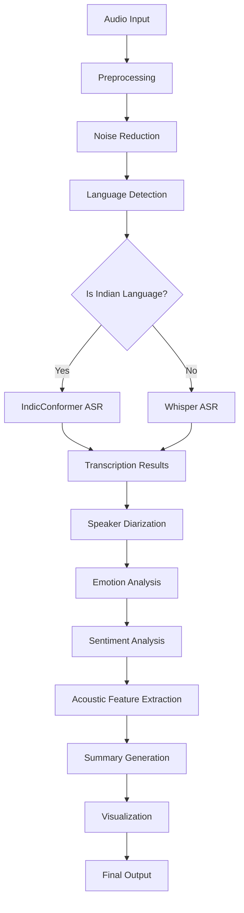

### Detailed Component Interactions

#### 1. Preprocessing Pipeline

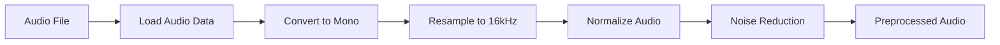

#### 2. Noise Reduction Process

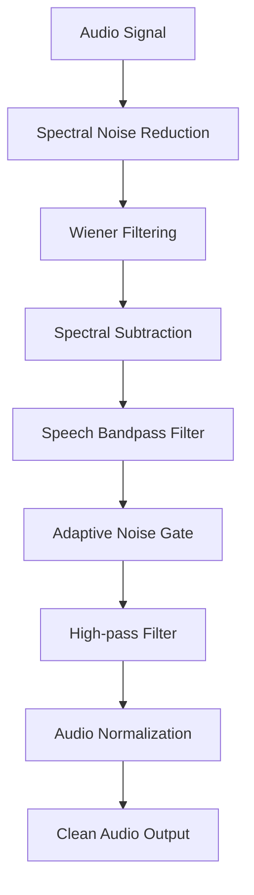

#### 3. Language Detection

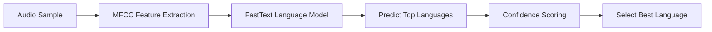

#### 4. Model Selection Logic

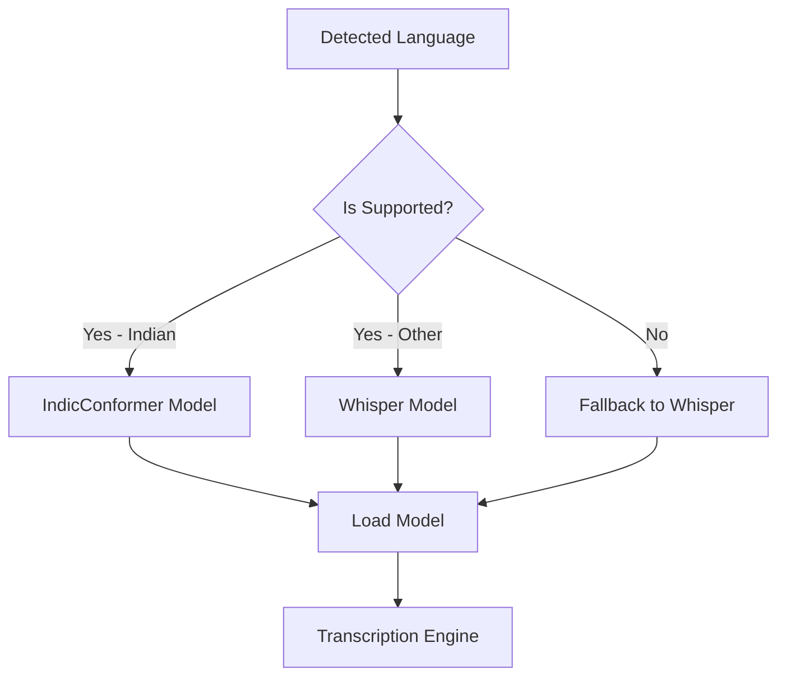

#### 5. IndicConformer Transcription

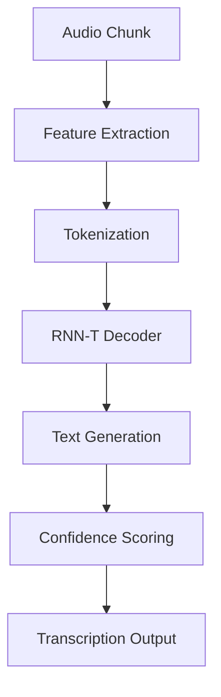

#### 6. Whisper Transcription

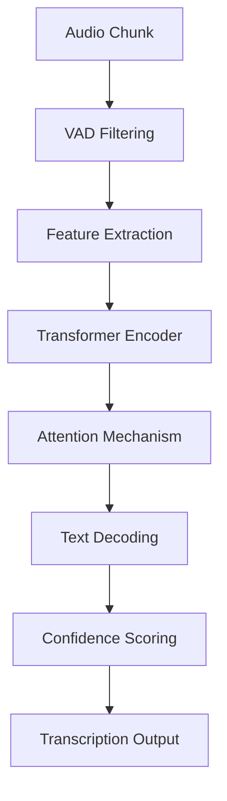

#### 7. Speaker Diarization

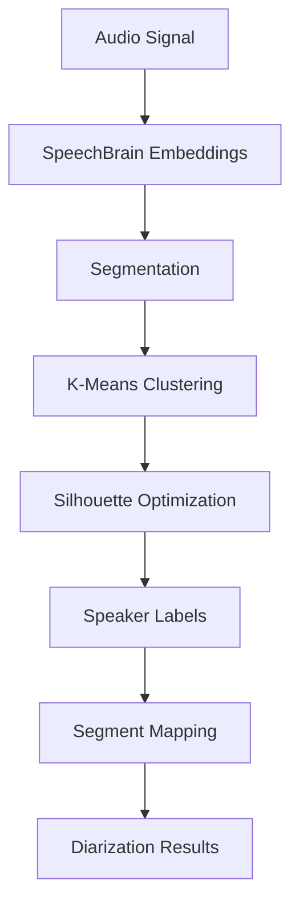

#### 8. Advanced Analysis Pipeline

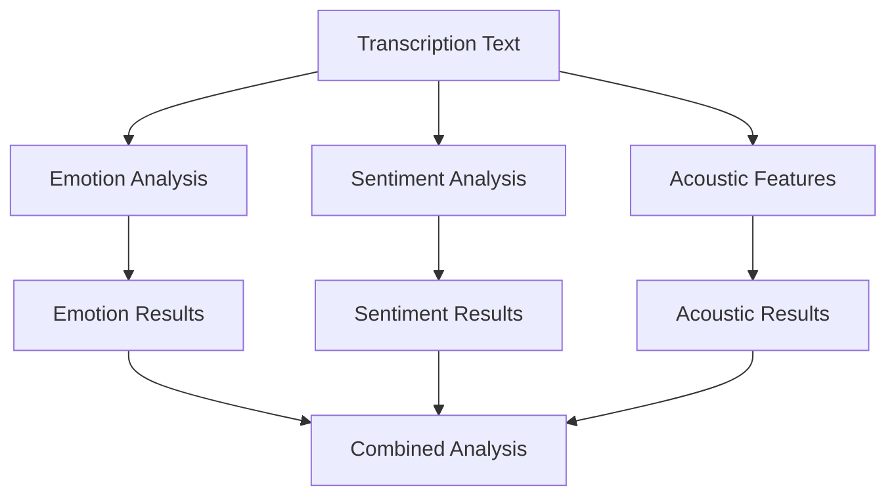

#### 9. Visualization Generation

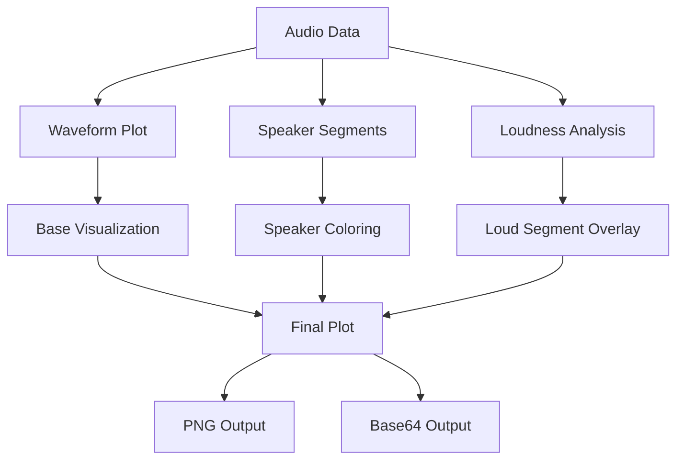

## Troubleshooting

### Common Errors and Solutions

#### Tokenizer Configuration Errors

##### Error: `KeyError: 'dir'` in IndicConformer Models

**Symptoms**:
- Model fails to load with `KeyError: 'dir'` in tokenizer configuration
- Error occurs during model restoration from .nemo file
- Affects both monolingual and multilingual IndicConformer models

**Root Cause**:
The NeMo model files expect specific tokenizer directory configurations, but these paths may be missing or incorrectly specified in the model configuration.

**Solution Implementation**:
The system implements a comprehensive workaround in `_preprocess_model_config` and `_load_model_with_tokenizer_workaround` methods:

```python
def _preprocess_model_config(self, model_path: str) -> Optional[str]:
    # Create temporary directories for tokenizer files
    tokenizer_temp_dir = tempfile.mkdtemp()
    
    # Fix paths for each language - create empty directories and set valid paths
    for lang_code, lang_cfg in tokenizer_cfg['langs'].items():
        if isinstance(lang_cfg, dict):
            # Create language-specific directory
            lang_dir = os.path.join(tokenizer_temp_dir, lang_code)
            os.makedirs(lang_dir, exist_ok=True)
            
            # Set the dir path to our temporary directory
            lang_cfg['dir'] = lang_dir
            
            # Create placeholder files if they don't exist
            model_path_file = os.path.join(lang_dir, "tokenizer.model")
            vocab_path_file = os.path.join(lang_dir, "vocab.txt")
            
            # Create empty placeholder files
            with open(model_path_file, 'w') as f:
                f.write("")  # Empty file
            with open(vocab_path_file, 'w') as f:
                f.write("")  # Empty file
```

**Verification Steps**:
1. Check logs for "🔧 Fixed tokenizer path for {lang_code}" messages
2. Confirm "✅ Tokenizer config paths fixed" appears in logs
3. Verify model loads successfully after fix

##### Error: `KeyError: 'num_classes'` in Decoder/Joint Configuration

**Symptoms**:
- Model fails to load with `KeyError: 'num_classes'` in decoder or joint configuration
- Error occurs during model instantiation
- Affects Hybrid RNNT-CTC models

**Root Cause**:
The model configuration contains fields that cause instantiation errors in the current NeMo version.

**Solution Implementation**:
The system removes problematic fields from decoder and joint configurations:

```python
# Check for decoder config issues - fix it properly by removing problematic fields
if 'decoder' in config:
    decoder_cfg = config['decoder']
    if isinstance(decoder_cfg, dict):
        # Remove problematic fields that cause instantiation errors
        fields_to_remove = ['num_classes']
        for field in fields_to_remove:
            if field in decoder_cfg:
                logger.info(f"🔧 Removing problematic field '{field}' from decoder configuration")
                del decoder_cfg[field]
```

**Verification Steps**:
1. Check logs for "🔧 Removing problematic field 'num_classes' from decoder configuration"
2. Confirm "🔧 Fixed decoder configuration" appears in logs
3. Verify model loads successfully after fix

#### CUDA and GPU Issues

##### Error: CUDA kernel errors with RTX 5080

**Symptoms**:
- Various CUDA-related errors when loading Whisper models
- Errors like "CUDA error: no kernel image is available for execution on the device"
- Model loading fails completely

**Root Cause**:
Incompatibility between model requirements and RTX 5080 GPU architecture/drivers.

**Solution Implementation**:
The system forces CPU usage for all models to avoid CUDA compatibility issues:

```python
def __init__(self, model_size: str = "small", device: str = "cuda", ...):
    # Force CPU mode to avoid CUDA issues with RTX 5080
    if device == "cpu":
        self.compute_type = "int8"
        self.beam_size = 1
        self.best_of = 1
    elif device == "cuda":
        # Still allow CUDA but with fallback
        self.compute_type = "int8_float16"  # Best VRAM/accuracy balance
        self.beam_size = 5
        self.best_of = 5
    else:
        # Default to CPU for any other device specification
        self.device = "cpu"
        self.compute_type = "int8"
        self.beam_size = 1
        self.best_of = 1
```

**Verification Steps**:
1. Check logs for "🔄 CUDA failed, falling back to CPU"
2. Confirm "✅ Faster Whisper {model_size} loaded successfully on CPU" appears
3. Verify transcription works with CPU processing

##### Error: Out of Memory (OOM) Errors

**Symptoms**:
- "CUDA out of memory" errors during processing
- System crashes or becomes unresponsive
- Processing fails for large audio files

**Root Cause**:
Large model sizes or long audio files exceed available GPU memory.

**Solution Implementation**:
The system implements multiple memory optimization techniques:

```python
# Chunking for long audio files
def _transcribe_with_chunking(self, file_path: str, language: Optional[str] = None,
                             translate_to_english: bool = False) -> Dict[str, Any]:
    # Load audio for chunking
    audio, sr = librosa.load(file_path, sr=16000, mono=True)
    total_duration = len(audio) / sr
    
    # Create chunks with overlap
    chunk_size = int(self.chunk_length * sr)
    overlap_size = int(2 * sr)  # 2-second overlap to prevent word cutting
    
    # Process chunks in parallel with limited workers
    max_workers = min(4, len(chunk_data))  # Limit concurrent workers
    with ThreadPoolExecutor(max_workers=max_workers) as executor:
        # Submit all chunk processing tasks
```

**Verification Steps**:
1. Check logs for "🔄 Using audio chunking ({chunk_length}s chunks) to reduce hallucination"
2. Confirm "📊 Audio duration: {duration}s, will create {chunks} chunks" appears
3. Verify processing completes without memory errors

#### Model Loading Failures

##### Error: `zipfile.BadZipFile` for .nemo Files

**Symptoms**:
- Model loading fails with "BadZipFile" error
- Error occurs when trying to extract .nemo model files
- Model files appear corrupted or incomplete

**Root Cause**:
.nemo files are actually tar archives, not zip files, or the files are corrupted.

**Solution Implementation**:
The system correctly handles .nemo files as tar archives and validates file integrity:

```python
def _preprocess_model_config(self, model_path: str) -> Optional[str]:
    try:
        with tempfile.TemporaryDirectory() as temp_dir:
            # Extract the .nemo file (it's a tar archive)
            with tarfile.open(model_path, 'r') as tar_ref:
                tar_ref.extractall(temp_dir)
            
            # Check if there's a config file
            config_path = os.path.join(temp_dir, "model_config.yaml")
            if os.path.exists(config_path):
                # Process config file
```

**Verification Steps**:
1. Check logs for proper extraction of .nemo files
2. Confirm "✅ Modified config saved successfully" appears
3. Verify model loads successfully after preprocessing

##### Error: Model Not Found

**Symptoms**:
- "No models available" error message
- System cannot find required model files
- Transcription fails with model loading errors

**Root Cause**:
Model files are missing from expected directories or paths are incorrect.

**Solution Implementation**:
The system implements comprehensive model file detection and fallback mechanisms:

```python
def __init__(self, models_dir: str = "models", use_cpu: bool = True, ...):
    # Check if models directory exists
    if not os.path.exists(self.models_dir):
        logger.warning(f"⚠️ Models directory not found: {self.models_dir}")
        # Try to create it
        try:
            os.makedirs(self.models_dir, exist_ok=True)
            logger.info(f"✅ Created models directory: {self.models_dir}")
        except Exception as e:
            logger.error(f"❌ Failed to create models directory: {e}")
        return
        
    # Check if models directory is empty
    model_files = [f for f in os.listdir(self.models_dir) if f.endswith('.nemo')]
    if not model_files:
        logger.warning(f"⚠️ No .nemo model files found in directory: {self.models_dir}")
        logger.info("💡 Please add model files to this directory when ready")
```

**Verification Steps**:
1. Check logs for model directory status messages
2. Confirm model files are present in correct locations
3. Verify system correctly identifies available models

#### Audio Processing Problems

##### Error: Audio Conversion Failures

**Symptoms**:
- "Audio conversion failed" error messages
- FFmpeg subprocess errors
- Audio files not processed correctly

**Root Cause**:
FFmpeg not installed, not in PATH, or audio format unsupported.

**Solution Implementation**:
The system implements robust error handling for audio conversion:

```python
def _convert_audio(self, input_path: str) -> str:
    try:
        # Create temporary file for converted audio
        temp_file = tempfile.NamedTemporaryFile(suffix='.wav', delete=False)
        temp_file.close()
        
        # Convert using ffmpeg with timeout
        try:
            result = subprocess.run([
                "ffmpeg", "-i", input_path,
                "-ac", "1", "-ar", "16000",
                temp_file.name, "-y"
            ], check=True, stdout=subprocess.PIPE, stderr=subprocess.PIPE, timeout=120)
            return temp_file.name
        except subprocess.TimeoutExpired:
            # Clean up temporary file if conversion timed out
            try:
                os.unlink(temp_file.name)
            except:
                pass
            raise Exception("Audio conversion timed out (took more than 120 seconds)")
        except subprocess.CalledProcessError as e:
            # Clean up temporary file if conversion failed
            try:
                os.unlink(temp_file.name)
            except:
                pass
            raise Exception(f"Audio conversion failed with return code {e.returncode}: {e.stderr.decode() if e.stderr else 'Unknown error'}")
```

**Verification Steps**:
1. Check logs for audio conversion status messages
2. Confirm FFmpeg is installed and accessible
3. Verify temporary files are properly cleaned up

##### Error: Empty Transcription Results

**Symptoms**:
- Transcription returns empty or whitespace-only results
- "Transcription result is empty" warning messages
- Valid audio produces no text output

**Root Cause**:
Poor audio quality, silence detection removing all content, or model issues.

**Solution Implementation**:
The system implements multiple fallback mechanisms for empty results:

```python
# Check if transcription is empty or just whitespace
transcription_text = str(result.get("text", "")).strip()
if not transcription_text:
    logger.warning(f"Transcription result is empty for {result.get('transcriber_name', 'Unknown')} model")
    # Try OpenAI Whisper as immediate fallback before using placeholder
    try:
        import whisper
        logger.info("🔄 Trying OpenAI Whisper as immediate fallback...")
        model = whisper.load_model("base")
        whisper_result = model.transcribe(tmp_file_path, language=detected_language if detected_language != "en" else None)
        if whisper_result and "text" in whisper_result:
            transcription = str(whisper_result["text"]).strip()
            if transcription:
                model_used = "openai-whisper-base"
                confidence = 0.85
                logger.info(f"✅ OpenAI Whisper transcription successful: {transcription[:100]}...")
```

**Verification Steps**:
1. Check logs for "Transcription result is empty" warnings
2. Confirm fallback mechanisms are triggered
3. Verify alternative transcription methods produce results

#### Language Detection Issues

##### Error: Incorrect Language Detection

**Symptoms**:
- Wrong language detected for audio files
- English audio misclassified as other languages
- Indian languages not properly identified

**Root Cause**:
FastText model limitations or insufficient audio features for accurate detection.

**Solution Implementation**:
The system implements enhanced language detection with special handling:

```python
def detect_language(audio_path: str, model, duration_sec: int = 30) -> str:
    # Special handling for English - if it's in top predictions with reasonable confidence, prefer it
    # This prevents English audio from being misclassified as other languages
    for i, lang_code in enumerate(lang_codes):
        if lang_code == 'en' and lang_probs[i] > 0.1:  # Higher threshold for English
            logger.info(f"🎯 Detected English language with high priority: {lang_code} (confidence: {lang_probs[i]:.2f})")
            return 'en'
    
    # Check if any Indian language is in top predictions with high confidence
    for i, lang_code in enumerate(lang_codes):
        if lang_code in INDIAN_LANGUAGES and lang_probs[i] > 0.15:  # Increased threshold for Indian languages
            logger.info(f"🎯 Detected Indian language: {lang_code} (confidence: {lang_probs[i]:.2f})")
            return lang_code
```

**Verification Steps**:
1. Check logs for language detection confidence scores
2. Confirm special handling for English and Indian languages
3. Verify correct language codes are returned

#### Speaker Diarization Failures

##### Error: Diarization Model Loading Failures

**Symptoms**:
- "SpeechBrain diarization failed" error messages
- PyAnnote authentication errors
- Speaker diarization returns mock results

**Root Cause**:
Missing dependencies, authentication issues, or model download failures.

**Solution Implementation**:
The system implements fallback mechanisms for diarization:

```python
def run_diarization(audio_path: str, hf_token: str = None) -> object:
    # Try SpeechBrain first (no authentication required)
    try:
        result = run_diarization_speechbrain(audio_path)
        if result is not None:
            return result
    except Exception as e:
        logger.warning(f"⚠️ SpeechBrain diarization failed: {e}")
    
    # Fall back to pyannote
    try:
        result = run_diarization_pyannote(audio_path, hf_token)
        if result is not None:
            return result
    except Exception as e:
        logger.warning(f"⚠️ Pyannote diarization failed: {e}")
    
    # If both fail, return a mock diarization result
    logger.warning("⚠️ Both SpeechBrain and Pyannote failed, returning mock diarization")
```

**Verification Steps**:
1. Check logs for diarization method attempts
2. Confirm fallback mechanisms are working
3. Verify speaker diarization produces reasonable results

### Performance Issues

#### Slow Processing Times

**Symptoms**:
- Long processing times for audio transcription
- High CPU/GPU utilization
- User experience degradation

**Root Causes**:
- Large model sizes
- Inefficient chunking strategies
- Suboptimal compute types
- Memory constraints

**Solutions**:
1. Implement fast mode for model loading (priority languages only)
2. Optimize chunking parameters for balance of accuracy and speed
3. Use appropriate compute types (int8 for CPU, int8_float16 for GPU)
4. Limit parallel workers to prevent resource contention

```python
# Fast mode implementation
def __init__(self, models_dir: str = "models", use_cpu: bool = True, fast_mode: bool = True):
    self.fast_mode = fast_mode
    # Priority languages for fast loading (include Marathi)
    self.priority_languages = ['hi', 'kn', 'ta', 'te', 'mr', 'ml'] if fast_mode else list(self.MODEL_FILES.keys())
```

#### Memory Leaks

**Symptoms**:
- Gradually increasing memory usage
- System slowdowns over time
- Out of memory errors after extended use

**Root Causes**:
- Models not properly unloaded
- Temporary files not cleaned up
- GPU memory not released

**Solutions**:
1. Implement proper cleanup in `__del__` methods
2. Ensure temporary files are deleted after use
3. Call `torch.cuda.empty_cache()` regularly

```python
def __del__(self):
    """Cleanup GPU memory."""
    try:
        for model in self.models.values():
            if model is not None:
                del model
        if self.multi_model:
            del self.multi_model
        if torch.cuda.is_available():
            torch.cuda.empty_cache()
    except:
        pass
```

### Debugging Techniques

#### Log Analysis

Enable detailed logging to diagnose issues:

```bash
# Set log level to DEBUG for detailed information
export LOG_LEVEL=DEBUG

# Run application with verbose logging
python main.py --log-level DEBUG
```

#### Model Testing

Test individual components in isolation:

```python
# Test IndicConformer models
from audio_processing.AI4Bharat.IndicConformerASR.indic_conformer_transcriber import create_indic_conformer_transcriber

transcriber = create_indic_conformer_transcriber()
result = transcriber.transcribe_file("test.wav", language="hi")
print(result)

# Test Whisper models
from audio_processing.core.faster_whisper_transcriber import FasterWhisperTranscriber

transcriber = FasterWhisperTranscriber(model_size="base", device="cpu")
result = transcriber.transcribe_file("test.wav", language="en")
print(result)
```

#### Dependency Verification

Check that all required dependencies are installed:

```bash
# Check Python packages
pip list | grep -E "(torch|transformers|librosa|fastapi)"

# Check system dependencies
which ffmpeg
which python3
```

### Log Analysis

#### Critical Log Messages

Look for these key log messages to diagnose issues:

1. **Model Loading Success**: "✅ {Language} model loaded successfully"
2. **Tokenizer Fixes**: "🔧 Fixed tokenizer path for {lang_code}"
3. **CUDA Fallback**: "🔄 CUDA failed, falling back to CPU"
4. **Chunking Activation**: "🔄 Using audio chunking ({chunk_length}s chunks)"
5. **Diarization Success**: "✅ SpeechBrain diarization completed"
6. **Noise Reduction**: "✅ Noise reduction completed"

#### Error Pattern Recognition

Common error patterns and their meanings:

1. **Tokenizer Errors**: Usually indicate model file corruption or configuration issues
2. **CUDA Errors**: Point to GPU compatibility problems
3. **File Not Found**: Suggest missing model files or incorrect paths
4. **Memory Errors**: Indicate resource constraints
5. **Timeout Errors**: Suggest processing taking too long

### Preventive Measures

#### Regular Maintenance

1. **Model File Validation**:
   - Periodically check model file integrity
   - Verify .nemo files are not corrupted
   - Ensure sufficient disk space for temporary files

2. **Dependency Updates**:
   - Keep Python packages up to date
   - Monitor for breaking changes in major libraries
   - Test updates in development before production

3. **Performance Monitoring**:
   - Track processing times for different audio types
   - Monitor memory usage patterns
   - Log resource utilization statistics

#### Configuration Best Practices

1. **Environment Setup**:
   ```bash
   # Set appropriate environment variables
   export HUGGINGFACE_TOKEN="your_token_here"
   export LOG_LEVEL=INFO
   ```

2. **Model Organization**:
   ```
   models/
   ├── indicconformer_stt_hi_hybrid_rnnt_large.nemo
   ├── indicconformer_stt_ta_hybrid_rnnt_large.nemo
   └── indicconformer_stt_multi_hybrid_rnnt_600m.nemo
   ```

3. **Audio File Preparation**:
   - Convert to WAV format when possible
   - Ensure sample rate is 16kHz for best results
   - Keep file sizes reasonable for processing limits

#### Monitoring and Alerting

Implement monitoring for critical system health indicators:

1. **Model Availability**:
   - Track successful model loads
   - Alert on model loading failures
   - Monitor for fallback usage

2. **Processing Performance**:
   - Track average processing times
   - Monitor for timeout occurrences
   - Alert on performance degradation

3. **Error Rates**:
   - Track transcription success rates
   - Monitor error patterns
   - Alert on unusual error spikes

## Performance Optimization

### Model Loading Optimization:
- Fast mode loads only priority languages (hi, kn, ta, te, mr, ml)
- Multi-language model as fallback for all Indian languages
- Lazy loading of models on first use

### Audio Processing Optimization:
- Parallel chunking for long audio files
- VAD filtering to remove silence
- Adaptive noise gate to reduce processing
- Efficient FFT parameters for spectral processing

### Memory Management:
- Temporary file cleanup after processing
- GPU memory cleanup with `torch.cuda.empty_cache()`
- Model unloading when no longer needed

### Compute Optimization:
- CPU mode for compatibility
- int8 compute type for CPU
- int8_float16 for GPU
- Reduced beam size for faster processing

## Future Improvements

### Model Enhancements:
1. Integration of larger Whisper models for improved accuracy
2. Fine-tuning of IndicConformer models on domain-specific data
3. Implementation of ensemble methods for combining multiple models
4. Addition of more Indian language models

### Performance Improvements:
1. Implementation of model quantization for faster inference
2. Better memory management for long audio files
3. Streaming transcription for real-time processing
4. GPU memory optimization for batch processing

### Feature Enhancements:
1. Real-time speaker diarization
2. Emotion detection from voice characteristics
3. Accent recognition and adaptation
4. Custom vocabulary support for domain-specific terms

### Error Handling Improvements:
1. More sophisticated fallback mechanisms
2. Better error reporting and logging
3. Automated model recovery from corruption
4. Graceful degradation for missing components

### API Improvements:
1. WebSocket support for real-time transcription
2. Batch processing for multiple files
3. Progress reporting for long-running tasks
4. Better caching mechanisms for repeated requests

## Conclusion


This comprehensive documentation provides a complete overview of the audio processing system, covering all aspects from architecture and components to usage examples and troubleshooting. The system is designed to handle a wide range of audio processing tasks with robust error handling and performance optimization features.

