# SmartClaim AI: Main Processing Steps

## Overview
SmartClaim AI is an end-to-end motor insurance claims processing platform that reduces claim settlement time from 7-10 days to 20-30 seconds using on-premise AI infrastructure with Llama 3.3 70B, computer vision, OCR, and RAG architecture.

## Technology Stack
- **LLM Inference Engine**: vLLM
- **Primary Model**: Llama 3.3 70B Instruct (for document processing)
- **Email Generation**: Mistral 7B Instruct (for faster response)
- **Vision Analysis**: Llama 3.2 11B Vision Instruct (for photo analysis)
- **RAG Framework**: LangChain with Weaviate vector database
- **OCR Processing**: Tesseract OCR + PaddleOCR (for Indian languages)
- **Computer Vision**: Custom AI models for damage detection
- **API Framework**: FastAPI with uvicorn
- **Database**: PostgreSQL with pgvector extension
- **Infrastructure**: NVIDIA A100 80GB GPUs (dual setup)
- **Storage**: AWS S3 or local NVMe storage
- **Monitoring**: Prometheus + Grafana
- **Security**: JWT tokens with 7-day expiration, HTTPS only

## Detailed Workflow Diagram

```mermaid
graph TD
    A[Claim Intimation] --> B[Claim Reference Generation]
    B --> C[Data Extraction from Intimation]
    C --> D[AI-Powered Acknowledgment Email]
    D --> E[Human Verification Required?]
    E -->|Yes| F[Queue for Human Review]
    E -->|No| G[Auto-Send Acknowledgment]
    F --> G
    G --> H[Create Case in CMS]
    H --> I[API Authentication]
    I --> J[Case Creation in Galaxy CMS]
    J --> K[Update SmartClaim Database]
    K --> L[Stakeholder Notifications]
    L --> M[Generate Survey Link]
    M --> N[Send Survey Link to Policyholder]
    N --> O[Document & Photo Upload]
    O --> P[Document Verification Pipeline]
    P --> Q[OCR Processing Tesseract/Paddle]
    Q --> R[LLM Field Extraction]
    R --> S[Cross-Verification Engine]
    S --> T[Quality Assessment]
    T --> U[Feedback Generation]
    U --> V[Damage Photo Verification]
    V --> W[Photo Classification AI]
    W --> X[Damage Detection & Analysis]
    X --> Y[Metadata Verification]
    Y --> Z[Quality Assessment]
    Z --> AA[Fraud Detection Indicators]
    AA --> AB[Admissibility Assessment]
    AB --> AC[RAG Policy Retrieval]
    AC --> AD[LLM Admissibility Analysis]
    AD --> AE[Decision: Admissible/Inadmissible]
    AE --> AF[Liability Calculation]
    AF --> AG[Repair Item Approval]
    AG --> AH[Deductible Application]
    AH --> AI[Liability Sheet Generation]
    AI --> AJ[Final Survey Report]
    AJ --> AK[Report Generation AI]
    AK --> AL[Human Verification Required?]
    AL -->|Yes| AM[Queue for Human Review]
    AL -->|No| AN[Auto-Approve Report]
    AM --> AN
    AN --> AO[Send to Insurer]
    
 
```

## Main Processing Steps

### 1. Claim Intimation & Acknowledgment
- **Trigger**: Claim intimation received via email, web portal, mobile app, or API call
- **Actions**:
  - Generate unique claim reference (format: CLM{YYYYMMDD}{6-digit alphanumeric})
  - Extract data from intimation (policy number, insured name, vehicle registration, contact details, accident details)
  - AI-powered acknowledgment email generation using Mistral 7B
  - Human verification workflow before sending email

### 2. CMS Integration & Case Creation
- **Integration**: REST API with Claims Management System (Galaxy CMS)
- **Workflow**:
  - API authentication with CMS
  - Create unique case ID in CMS
  - Update SmartClaim database with CMS case ID
  - Automated notifications to internal claims team, assigned surveyor, and policyholder

### 3. Automated Survey Link Generation
- **Portal Features**:
  - Generate secure survey URL: `https://survey.smartclaim.ai/{claim_reference}/{secure_token}`
  - Provide document upload interface with real-time validation
  - Camera integration with AR guidance for photograph uploads
  - Progress tracking and confirmation submission

### 4. Document Verification & Validation
- **Required Documents**:
  - Policy Copy, Claim Form, RC Book, Driving License, Repair Estimate, KYC Documents
- **Processing Pipeline**:
  - OCR processing using Tesseract and PaddleOCR
  - LLM-based field extraction (Llama 3.3 70B with RAG)
  - Cross-verification of documents using fuzzy matching and validation rules
  - Automated quality assessment with feedback generation

### 5. Damage Photograph Verification
- **Required Photos**:
  - Front, rear, left side, right side, top view, damage close-ups
  - Vehicle number plates, chassis number, engine number, odometer reading
- **AI Processing**:
  - Photo classification using Llama 3.2 11B Vision
  - Damage detection and analysis
  - Metadata verification (timestamp, GPS coordinates)
  - Quality assessment and fraud detection indicators

### 6. Admissibility Assessment
- **Criteria Checklist**:
  - Policy coverage verification using RAG-enhanced analysis
  - Driver validity (valid license on accident date)
  - Exclusions check (DUI, commercial use, etc.)
  - Add-on coverage applicability
- **Decision Process**:
  - Retrieve relevant policy clauses using RAG
  - LLM admissibility determination with confidence scoring
  - Generate admissibility report with reasoning

### 7. Liability Calculation
- **Components**:
  - Approved repair cost calculation with depreciation
  - Deductible application
  - Salvage value consideration for total loss
- **Process**:
  - Compare estimated repairs with photo analysis
  - Apply policy terms (depreciation rates, deductibles)
  - Generate detailed liability assessment sheet

### 8. Final Survey Report Generation
- **Report Structure**:
  - Executive summary with decision and liability amount
  - Detailed claim and vehicle information
  - Document verification summary
  - Damage assessment with photographic evidence
  - Admissibility analysis with policy references
  - Liability calculation breakdown
  - Recommendations for approval
- **Output Formats**: PDF, JSON, HTML

## System Performance
- **Processing Time**: 20-30 seconds per claim (vs 7-10 days manual)
- **Throughput**: 8,000-12,000 claims per day
- **Accuracy**: 95%+ document extraction, 90%+ admissibility decisions

- **Straight-Through Processing**: 60% of claims with zero human intervention
