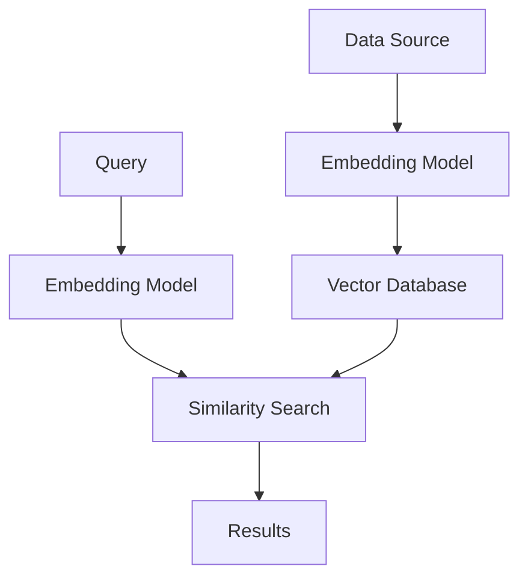
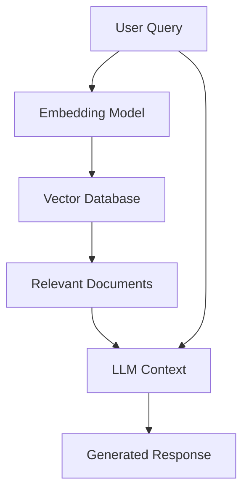
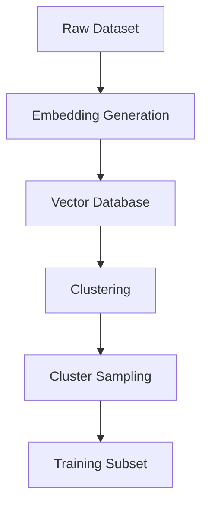

# Vector Databases Documentation

This document provides detailed explanations for popular vector databases, including their key features, use cases, and architectures. For each, pros and cons are outlined based on performance, scalability, ease of use, and other factors as of 2025. The focus is on their roles in handling high-dimensional vector data for AI/ML applications like similarity search, RAG (Retrieval-Augmented Generation), and semantic search.

## Table of Contents
1. [Introduction to Vector Databases](#introduction-to-vector-databases)
2. [Mathematical Foundations](#mathematical-foundations)
3. [Weaviate](#weaviate)
4. [Milvus](#milvus)
5. [FAISS](#faiss)
6. [Qdrant](#qdrant)
7. [Pinecone](#pinecone)
8. [MongoDB Atlas Vector Search](#mongodb-atlas-vector-search)
9. [SQLite with sqlite-vss Extension](#sqlite-with-sqlite-vss-extension)
10. [ChromaDB](#chromadb)
11. [Implementation Examples](#implementation-examples)
12. [Performance Benchmarks](#performance-benchmarks)
13. [Workflow Diagrams](#workflow-diagrams)
14. [Comparison Summary](#comparison-summary)
15. [Choosing the Right Vector Database](#choosing-the-right-vector-database)

## Introduction to Vector Databases

Vector databases are specialized storage systems designed to efficiently store, manage, and query high-dimensional vector embeddings. These embeddings are numerical representations of data (text, images, audio) in a continuous vector space, where similar items are positioned close to each other.

In machine learning and artificial intelligence applications, vector databases play a crucial role in:
- **Similarity Search**: Finding items similar to a query item based on vector proximity
- **Retrieval-Augmented Generation (RAG)**: Providing context to large language models
- **Recommendation Systems**: Suggesting relevant items based on user preferences
- **Anomaly Detection**: Identifying outliers in data distributions
- **Clustering**: Grouping similar data points together

Vector databases differ from traditional relational databases in several key ways:
- They use specialized indexing structures optimized for high-dimensional spaces
- They employ distance metrics like cosine similarity, Euclidean distance, or dot product
- They prioritize approximate nearest neighbor (ANN) search over exact matches for performance
- They handle dense vector data rather than discrete categorical or numerical values

## Mathematical Foundations

Understanding vector databases requires familiarity with several mathematical concepts:

### Distance Metrics

**Cosine Similarity**: Measures the cosine of the angle between two vectors, ignoring magnitude:
```
cos(θ) = (A · B) / (||A|| × ||B||)
```
Where A·B is the dot product and ||A|| is the L2 norm of vector A.

**Euclidean Distance**: Measures the straight-line distance between two points in space:
```
d(A,B) = √Σ(Ai - Bi)²
```

**Dot Product**: Measures the projection of one vector onto another:
```
A · B = Σ(Ai × Bi)
```

### Indexing Algorithms

**Hierarchical Navigable Small World (HNSW)**: Constructs a multi-layer graph where higher layers provide shortcuts for faster navigation. Search complexity is approximately O(log N).

**Inverted File Index (IVF)**: Partitions the vector space into clusters using k-means, then searches only within the closest clusters. Reduces search complexity from O(N) to O(N/nlists).

**Locality-Sensitive Hashing (LSH)**: Maps similar vectors to the same hash buckets with high probability, enabling sub-linear search times.

**Product Quantization (PQ)**: Compresses vectors by dividing them into sub-vectors and representing each with a centroid from a codebook, significantly reducing memory requirements.

## Weaviate

Weaviate is an open-source, cloud-native vector database that combines vector search with knowledge graph capabilities. It transforms unstructured data (text, images, etc.) into searchable vectors using machine learning models. Weaviate supports hybrid searches blending semantic similarity with graph traversals, making it ideal for contextual applications like Q&A systems, summarization, and categorization. It uses HNSW (Hierarchical Navigable Small World) indexing for efficient queries and offers modular integration with services like OpenAI or Hugging Face. Deployment options include self-hosted (via Docker/Kubernetes) or managed cloud services, with GraphQL APIs for flexible querying.

### Key Features
- **Knowledge Graph Integration**: Combines vector search with knowledge graph capabilities for enhanced contextual understanding
- **Hybrid Search**: Supports searches that blend semantic similarity with graph traversals
- **Multi-modal Data Support**: Handles various data types including text, images, and more
- **Modular Architecture**: Integrates with popular ML models and services
- **Cloud-native Design**: Built for modern deployment environments

### Architecture
Weaviate's architecture is designed around a modular, cloud-native approach:
- Vector storage layer with HNSW indexing
- GraphQL API for querying
- Integration modules for various ML models
- Containerized deployment options

### Use Cases
- Question-Answering Systems
- Document Summarization
- Content Categorization
- Semantic Search Applications
- Knowledge Management Systems

### Technical Implementation Details
Weaviate implements several advanced techniques for performance optimization:

1. **Graph-based Indexing**: Uses HNSW algorithm to create navigable graphs for efficient search
2. **Schema-first Approach**: Requires defining a schema before inserting data, enabling optimization
3. **Batch Operations**: Supports bulk imports for efficient data loading
4. **Caching Mechanisms**: Implements LRU caching for frequently accessed vectors

### API Examples

Creating a schema:
```graphql
{
  "class": "Document",
  "properties": [
    {
      "name": "content",
      "dataType": ["text"]
    }
  ],
  "vectorizer": "text2vec-transformers"
}
```

Performing a hybrid search:
```graphql
{
  Get {
    Document(
      hybrid: {
        query: "machine learning algorithms",
        alpha: 0.7
      }
    ) {
      content
      _additional {
        score
      }
    }
  }
}
```

### Pros
- Combines vector search with knowledge graphs for enhanced contextual understanding and sophisticated queries
- GraphQL API enables intuitive, flexible querying with filtering, aggregation, and conditional logic
- Supports multi-modal data (e.g., text, images) and hybrid search (semantic + keyword)
- Scalable through sharding and replication, with built-in modules for AI-powered features like automated vectorization
- Open-source core with commercial hosting options, allowing seamless ML model integration

### Cons
- Steeper learning curve due to GraphQL and schema requirements
- More complex setup and resource-intensive for large deployments
- Distributed configurations can be challenging to optimize
- Not always the fastest in pure vector search benchmarks when using complex graph features

## Milvus

Milvus is a highly popular open-source vector database optimized for large-scale similarity searches and AI applications. It features a cloud-native architecture with separated storage and compute layers for horizontal scalability. Milvus supports multiple index types (e.g., HNSW, IVF, DiskANN) and hybrid searches combining vector similarity with scalar filtering and full-text matching. It's suitable for use cases like image search, chatbots, and chemical structure analysis, handling billions of vectors with low-latency queries (single-digit milliseconds). Deployment options include lite (local), standalone, or distributed (Kubernetes), with SDKs in Python, Java, Go, and more.

### Key Features
- **Cloud-native Architecture**: Separated storage and compute layers for horizontal scalability
- **Multiple Index Types**: Supports various algorithms including HNSW, IVF, and DiskANN
- **Hybrid Search Capabilities**: Combines vector similarity with scalar filtering
- **Massive Scale Support**: Handles billions of vectors with low latency
- **Multi-language SDKs**: Available in Python, Java, Go, and more

### Architecture
Milvus follows a microservices architecture with distinct components:
- Coordinator services for metadata management
- Index nodes for building vector indexes
- Query nodes for handling search requests
- Data nodes for data persistence
- Separated storage layer for scalability

### Use Cases
- Image and Video Search
- Recommendation Systems
- Chatbots and Virtual Assistants
- Chemical Structure Analysis
- Similarity Detection in Large Datasets

### Technical Implementation Details
Milvus implements several advanced techniques for performance optimization:

1. **Storage-Compute Separation**: Enables independent scaling of storage and compute resources
2. **Time Travel**: Allows querying data at specific timestamps for consistency
3. **Bulk Insert**: Optimizes large data ingestion through batch processing
4. **Dynamic Partitioning**: Automatically distributes data across partitions for load balancing

### API Examples

Connecting to Milvus:
```python
from pymilvus import connections, Collection

connections.connect("default", host="localhost", port="19530")
```

Creating a collection:
```python
from pymilvus import CollectionSchema, FieldSchema, DataType

# Define fields
book_id = FieldSchema(
    name="book_id",
    dtype=DataType.INT64,
    is_primary=True,
    auto_id=False,
)

book_name = FieldSchema(
    name="book_name",
    dtype=DataType.VARCHAR,
    max_length=200,
)

book_intro = FieldSchema(
    name="book_intro",
    dtype=DataType.FLOAT_VECTOR,
    dim=2
)

# Create schema
schema = CollectionSchema(
    fields=[book_id, book_name, book_intro],
    description="Test book search"
)

collection = Collection(
    name="book",
    schema=schema,
    using='default',
    shards_num=2
)
```

Performing a search:
```python
search_params = {
    "metric_type": "L2",
    "params": {"nprobe": 10},
}

results = collection.search(
    data=[[0.1, 0.2]],
    anns_field="book_intro",
    param=search_params,
    limit=10,
    expr=None,
    consistency_level="Strong"
)
```

### Pros
- Excellent scalability for massive datasets (trillions of vectors) with horizontal scaling and high availability
- Multiple indexing algorithms and distance metrics (Euclidean, Cosine) for workload optimization
- Hybrid search capabilities, including metadata filtering and time travel for point-in-time queries
- Strong community support, frequent updates, and easy migration tools (e.g., Vector Transport Service)
- Disk-based storage with caching for cost-effective handling of large data beyond RAM limits

### Cons
- Complex configuration for distributed setups and optimization
- Resource-intensive at scale, requiring significant infrastructure
- Steeper learning curve compared to simpler alternatives
- Community support may vary, and migrations still require testing

## FAISS

FAISS (Facebook AI Similarity Search) is an open-source library from Meta AI Research focused on efficient similarity search and clustering of dense vectors. Unlike full databases, it's a C++-based library (with Python bindings) optimized for CPU/GPU acceleration, supporting approximate nearest neighbor (ANN) searches. It offers various index types (e.g., FlatL2 for exact search, IVF, HNSW, PQ for compression) and is ideal for research, prototyping, or integration into custom systems for applications like image recognition or recommendation engines. FAISS excels in high-dimensional spaces but requires additional components for persistence and production use.

### Key Features
- **High Performance**: Optimized for CPU/GPU acceleration
- **Multiple Index Types**: Various algorithms for different use cases
- **Approximate Nearest Neighbor**: Efficient search algorithms for large datasets
- **Research-focused**: Ideal for prototyping and custom implementations
- **Language Bindings**: Available in Python with C++ core

### Architecture
FAISS is designed as a library rather than a complete database:
- Core algorithms implemented in C++ for performance
- Python bindings for ease of use
- GPU acceleration support
- Various index implementations for different trade-offs

### Use Cases
- Image Recognition Systems
- Recommendation Engines
- Research Prototypes
- Custom AI Applications
- Clustering Large Datasets

### Technical Implementation Details
FAISS implements several advanced techniques for performance optimization:

1. **GPU Acceleration**: Leverages CUDA for massive parallelization of distance computations
2. **Memory Management**: Implements efficient memory pooling to reduce allocation overhead
3. **Coarse Quantization**: Uses techniques like IVF to reduce search space before fine-grained comparison
4. **Compression Techniques**: Employs product quantization and other methods to reduce memory footprint

### API Examples

Basic usage:
```python
import faiss
import numpy as np

# Generate sample data
dimension = 128
nb = 10000
np.random.seed(1234)
xb = np.random.random((nb, dimension)).astype('float32')

# Create index
index = faiss.IndexFlatL2(dimension)
index.add(xb)

# Perform search
k = 4
xq = np.random.random((1, dimension)).astype('float32')
distances, indices = index.search(xq, k)
```

Using IVF index:
```python
# Create IVF index
nlist = 100
quantizer = faiss.IndexFlatL2(dimension)
index_ivf = faiss.IndexIVFFlat(quantizer, dimension, nlist)

# Train the index
index_ivf.train(xb)

# Add vectors
index_ivf.add(xb)

# Search
index_ivf.nprobe = 10  # Number of clusters to visit
distances, indices = index_ivf.search(xq, k)
```

### Pros
- Exceptional performance for in-memory searches, often the fastest with GPU acceleration
- Memory-efficient through compression techniques like product quantization
- Flexible index types for balancing speed, accuracy, and memory usage
- Supports batch processing, multiple nearest neighbors, and various distances (L2, inner product)
- Fine-grained tuning for custom workloads, with strong scientific foundations

### Cons
- Not a complete database; lacks built-in persistence, requiring integration with other storage
- Steeper learning curve, assuming knowledge of underlying algorithms
- Limited for distributed deployments without extra engineering
- No native metadata filtering or production-ready features like ACID compliance

## Qdrant

Qdrant is an open-source vector similarity search engine written in Rust, emphasizing high performance and production readiness. It provides REST/gRPC APIs for storing and querying vectors with associated payloads, excelling in filtered searches (e.g., metadata, geo-locations). Qdrant uses HNSW indexing for low-latency queries (under 75ms) and supports ACID-compliant operations with point-in-time consistency. It's suitable for semantic matching, faceted search, and RAG apps, with deployments via Docker (self-hosted) or managed cloud. Collections act like tables for data organization.

### Key Features
- **Rust Implementation**: High performance and memory safety
- **Payload Filtering**: Advanced filtering capabilities on metadata
- **ACID Compliance**: Supports transactional operations
- **Multiple APIs**: REST and gRPC interfaces
- **Geo-location Support**: Built-in support for spatial data

### Architecture
Qdrant's architecture emphasizes performance and reliability:
- Written in Rust for memory safety and performance
- REST/gRPC APIs for client interaction
- HNSW indexing for efficient similarity search
- Collection-based data organization
- Write-Ahead Logging for durability

### Use Cases
- Semantic Matching Applications
- Faceted Search Systems
- Retrieval-Augmented Generation (RAG)
- Location-based Services
- E-commerce Recommendation Systems

### Technical Implementation Details
Qdrant implements several advanced techniques for performance optimization:

1. **Memory-mapped Storage**: Uses mmap for efficient disk I/O operations
2. **Segment-based Architecture**: Divides collections into segments for parallel processing
3. **Optimistic Concurrency Control**: Implements MVCC for concurrent access without locks
4. **Customizable Indexing**: Allows fine-tuning of HNSW parameters for specific workloads

### API Examples

Creating a collection:
```python
from qdrant_client import QdrantClient
from qdrant_client.models import VectorParams, Distance

client = QdrantClient(host="localhost", port=6333)

client.create_collection(
    collection_name="my_collection",
    vectors_config=VectorParams(size=128, distance=Distance.COSINE)
)
```

Adding points:
```python
from qdrant_client.models import PointStruct

client.upsert(
    collection_name="my_collection",
    points=[
        PointStruct(
            id=1,
            vector=[0.1, 0.2, 0.3, 0.4],
            payload={"city": "Berlin", "country": "Germany"}
        ),
        PointStruct(
            id=2,
            vector=[0.5, 0.6, 0.7, 0.8],
            payload={"city": "London", "country": "United Kingdom"}
        )
    ]
)
```

Performing a search:
```python
search_result = client.search(
    collection_name="my_collection",
    query_vector=[0.2, 0.3, 0.4, 0.5],
    limit=3,
    query_filter=None
)
```

Filtered search:
```python
from qdrant_client.models import Filter, FieldCondition, MatchValue

search_result = client.search(
    collection_name="my_collection",
    query_vector=[0.2, 0.3, 0.4, 0.5],
    query_filter=Filter(
        must=[
            FieldCondition(
                key="country",
                match=MatchValue(value="Germany")
            )
        ]
    ),
    limit=3
)
```

### Pros
- High performance and reliability with efficient payload-based filtering (AND/OR/NOT conditions)
- Memory-efficient and scalable for large datasets, with horizontal/vertical options
- Easy-to-use APIs and excellent documentation, reducing developer onboarding time
- Independent operation without external dependencies, plus Write-Ahead Logging for durability
- Flexible for hybrid searches and familiar to traditional DB users

### Cons
- Less mature ecosystem and smaller community than established alternatives
- Query performance can degrade with highly complex filters or high-cardinality data
- Horizontal scaling features are evolving, with limited tooling for massive clusters
- Limited built-in analytics compared to more feature-rich databases

## Pinecone

Pinecone is a fully managed, cloud-native vector database designed for high-performance AI applications. It offers a serverless API with no infrastructure management, supporting hybrid searches (semantic + keyword) and sparse-dense indexes. Pinecone handles real-time ingestion and queries (under 50ms latency) for billions of vectors, with automatic scaling across availability zones. It's ideal for duplicate detection, ranking, and classification in production environments, integrating with ML frameworks like LangChain.

### Key Features
- **Fully Managed**: No infrastructure management required
- **Serverless Architecture**: Automatic scaling based on demand
- **Hybrid Search**: Combines semantic and keyword searches
- **Real-time Processing**: Low latency for ingestion and queries
- **Enterprise Features**: Security, backups, and multi-zone deployment

### Architecture
Pinecone's architecture is built for enterprise-scale applications:
- Serverless infrastructure with automatic scaling
- Distributed system across availability zones
- Sparse-dense index technology
- Integration with popular ML frameworks
- Managed security and compliance features

### Use Cases
- Duplicate Detection Systems
- Content Ranking and Classification
- Production-scale RAG Applications
- Real-time Recommendation Engines
- Enterprise Search Solutions

### Technical Implementation Details
Pinecone implements several advanced techniques for performance optimization:

1. **Sparse-Dense Indexing**: Combines sparse and dense representations for hybrid search capabilities
2. **Global Replication**: Automatically replicates data across regions for low-latency access
3. **Adaptive Indexing**: Dynamically adjusts index structures based on query patterns
4. **Incremental Updates**: Supports real-time updates without full reindexing

### API Examples

Initializing client:
```python
import pinecone

pinecone.init(
    api_key="YOUR_API_KEY",
    environment="us-west1-gcp"
)

# Create index
pinecone.create_index(
    "quickstart",
    dimension=8,
    metric="euclidean",
    pod_type="p1"
)
```

Inserting data:
```python
index = pinecone.Index("quickstart")

index.upsert([
    ("A", [0.1, 0.1, 0.1, 0.1, 0.1, 0.1, 0.1, 0.1]),
    ("B", [0.2, 0.2, 0.2, 0.2, 0.2, 0.2, 0.2, 0.2]),
    ("C", [0.3, 0.3, 0.3, 0.3, 0.3, 0.3, 0.3, 0.3])
])
```

Performing a query:
```python
results = index.query(
    vector=[0.3, 0.3, 0.3, 0.3, 0.3, 0.3, 0.3, 0.3],
    top_k=3,
    include_values=True
)
```

### Pros
- Fully managed with automatic scaling, eliminating ops overhead
- High query speed and accuracy, with hybrid search and metadata filtering
- Seamless integration for RAG and ML workflows, including embedding generation
- Strong security and reliability features like backups and multi-zone deployment
- Excellent for enterprise-scale without custom tuning

### Cons
- Higher costs (e.g., $200-500/month for 1M vectors) compared to open-source options
- Limited customization due to managed nature; no on-premises support
- Potential vendor lock-in with proprietary pricing
- Less flexibility for specialized indexing needs

## MongoDB Atlas Vector Search

MongoDB Atlas Vector Search integrates semantic search into the MongoDB document database, using HNSW indexing for efficient vector queries. It supports hybrid searches combining vectors with traditional filters and aggregations, ideal for teams already using MongoDB. Deployment includes managed Atlas (cloud) or self-hosted, with sharding for scalability. It handles up to 16MB per document and offers strong transaction guarantees, encryption, and backups.

### Key Features
- **Integrated Solution**: Combines vector search with document database
- **Hybrid Queries**: Mix vector and traditional database queries
- **Familiar Interface**: Uses standard MongoDB query language
- **Scalability**: Sharding support for large datasets
- **Enterprise Features**: Security, backups, and compliance

### Architecture
MongoDB Atlas Vector Search extends the existing MongoDB architecture:
- Built on MongoDB's sharded cluster architecture
- HNSW indexing for vector similarity search
- Integration with aggregation pipeline
- Standard MongoDB security and backup features
- Atlas management console for monitoring

### Use Cases
- Content Management Systems
- E-commerce Product Search
- Customer Support Systems
- Personalization Engines
- Document Analysis Applications

### Technical Implementation Details
MongoDB Atlas Vector Search implements several advanced techniques:

1. **Aggregation Pipeline Integration**: Seamlessly integrates vector search with existing MongoDB operations
2. **Sharded Vector Indexes**: Distributes vector indexes across shards for scalability
3. **Score Normalization**: Provides normalized relevance scores for consistent ranking
4. **Query Optimization**: Automatically optimizes queries based on index statistics

### API Examples

Creating a vector search index:
```javascript
db.products.createIndex({
  "embeddings": "vectorSearch"
}, {
  "type": "vectorSearch",
  "options": {
    "dimensions": 1536,
    "similarity": "euclidean"
  }
})
```

Performing a vector search:
```javascript
db.products.aggregate([{
  "$vectorSearch": {
    "index": "default",
    "path": "embeddings",
    "queryVector": [0.15, 0.12, 0.34, /* ... */],
    "numCandidates": 100,
    "limit": 10
  }
}])
```

Hybrid search with filtering:
```javascript
db.products.aggregate([{
  "$vectorSearch": {
    "index": "default",
    "path": "embeddings",
    "queryVector": [0.15, 0.12, 0.34, /* ... */],
    "numCandidates": 100,
    "limit": 10
  }
}, {
  "$match": {
    "category": "electronics"
  }
}])
```

### Pros
- Seamless integration with existing MongoDB setups, no data migration needed
- Hybrid queries using familiar MongoDB language, with multiple vector fields per document
- Independent scaling of database and search index for optimized performance
- High availability, durability, and security features like field-level encryption
- Supports large documents and real-time updates via aggregation pipelines

### Cons
- Performance may lag behind specialized vector DBs for pure similarity searches
- Costs can escalate on Atlas (e.g., $200-600/month for 1M vectors) with high volumes
- Medium scaling complexity compared to serverless options
- Less optimized for standalone vector workloads without MongoDB ecosystem

## SQLite with sqlite-vss Extension

SQLite, extended with sqlite-vss (Vector Similarity Search), turns the lightweight relational database into a local vector store. It's ideal for embedded or offline apps, supporting vector searches via extensions like FAISS integration. SQLite-vss adds ANN capabilities for similarity queries, with persistence in a single file. It's not a full-scale vector DB but suits prototyping, mobile apps, or small-scale RAG where no server is needed.

### Key Features
- **Lightweight**: Single-file database with no server required
- **Embedded**: Ideal for mobile and desktop applications
- **Offline Capability**: Works without internet connectivity
- **Extension-based**: Adds vector search to existing SQLite
- **Simple Deployment**: Minimal setup requirements

### Architecture
The sqlite-vss extension enhances SQLite's capabilities:
- Standard SQLite storage engine
- Vector similarity search extension
- Single-file persistence
- FAISS integration for ANN algorithms
- SQL-based querying interface

### Use Cases
- Mobile Applications
- Desktop Software
- Prototyping and Development
- Offline AI Applications
- Edge Computing Solutions

### Technical Implementation Details
SQLite with VSS implements several optimizations:

1. **FAISS Integration**: Leverages FAISS algorithms for efficient similarity search
2. **Virtual Tables**: Uses SQLite virtual table mechanism for vector operations
3. **Memory Mapping**: Utilizes memory-mapped files for efficient I/O
4. **Query Planning**: Integrates with SQLite's query planner for optimization

### API Examples

Creating a vector table:
```sql
CREATE VIRTUAL TABLE vss_articles USING vss0(
  headline_embeddings(384)
);
```

Inserting vector data:
```sql
INSERT INTO vss_articles(rowid, headline_embeddings)
VALUES (1, '[0.1, 0.2, 0.3, /* ... */]');
```

Performing similarity search:
```sql
SELECT rowid, vss_distance(headline_embeddings, '[0.15, 0.25, 0.35, /* ... */]')
FROM vss_articles
WHERE vss_search(headline_embeddings, '[0.15, 0.25, 0.35, /* ... */]')
ORDER BY vss_distance(headline_embeddings, '[0.15, 0.25, 0.35, /* ... */]')
LIMIT 10;
```

### Pros
- Extremely lightweight and portable, with no server required (single-file storage)
- Simple deployments, low latency, and easy maintenance for local/offline use
- Integrates with existing SQLite ecosystems, syncing later with cloud DBs
- Cost-free and scalable for small datasets, with easy embedding in apps
- Supports basic vector similarity via extensions, reducing setup time

### Cons
- Limited scalability for large datasets or high-throughput queries
- Lacks distributed features, high availability, or advanced filtering
- Not optimized for production-scale AI workloads; performance drops with growth
- Requires extensions like sqlite-vss, which may need manual management

## ChromaDB

ChromaDB (or Chroma) is an open-source, AI-native vector database focused on embeddings for LLM and RAG applications. It simplifies building "ChatGPT-like" systems by handling storage, embedding, and querying with a Python-first API. Chroma supports in-memory or client/server modes, with features like filtering, density estimates, and integrations (e.g., LangChain, LlamaIndex). It's scalable via cloud-native designs and ideal for prototyping, with deployments from local to managed cloud.

### Key Features
- **AI-native Design**: Built specifically for LLM and RAG applications
- **Python-first API**: Simple interface for Python developers
- **Flexible Deployment**: In-memory or client/server modes
- **Rich Integrations**: Works with LangChain, LlamaIndex, and more
- **Built-in Filtering**: Advanced query filtering capabilities

### Architecture
Chroma's architecture focuses on simplicity and AI integration:
- Client-server or in-memory deployment options
- Python-first API design
- Integration with popular AI frameworks
- Cloud-native scalability features
- Built-in embedding management

### Use Cases
- Chatbot Development
- RAG Applications
- LLM-powered Search
- Prototyping AI Applications
- Educational Projects

### Technical Implementation Details
ChromaDB implements several features for AI workflows:

1. **Embedding Management**: Handles embedding generation and storage transparently
2. **Metadata Indexing**: Creates secondary indexes on metadata for fast filtering
3. **Collection Management**: Organizes data into collections for multi-tenancy
4. **Client-Server Architecture**: Supports distributed deployments for team collaboration

### API Examples

Initializing Chroma:
```python
import chromadb

client = chromadb.Client()
collection = client.create_collection(name="my_collection")
```

Adding documents:
```python
collection.add(
    documents=[
        "This is document 1",
        "This is document 2"
    ],
    metadatas=[
        {"source": "my_source"},
        {"source": "my_source"}
    ],
    ids=["id1", "id2"]
)
```

Querying:
```python
results = collection.query(
    query_texts=["This is a query"],
    n_results=2,
    where={"source": "my_source"}
)
```

### Pros
- Extremely easy to use with simple APIs and tight RAG framework integrations
- Feature-rich for queries, filtering, and upcoming intelligent grouping
- Free open-source version; low-cost for small-scale (free-$50/month for 1M vectors)
- Fast query speeds (100-200ms) and accessible for Python developers
- Multi-tenant, cloud-native scalability with minimal configuration

### Cons
- Less mature, with performance issues for datasets over 100,000 vectors
- Limited enterprise features like advanced security or high availability
- Fewer indexing options and production-ready tools compared to established DBs
- Struggles with large-scale or complex workloads without enhancements

## Implementation Examples

### RAG Application with Weaviate

```python
import weaviate
import openai

# Connect to Weaviate
client = weaviate.Client("http://localhost:8080")

# Create schema
schema = {
    "classes": [{
        "class": "Document",
        "properties": [
            {
                "name": "content",
                "dataType": ["text"]
            },
            {
                "name": "source",
                "dataType": ["string"]
            }
        ],
        "vectorizer": "text2vec-openai"
    }]
}

client.schema.create(schema)

# Add documents
documents = [
    "Machine learning is a subset of artificial intelligence...",
    "Deep learning uses neural networks with multiple layers...",
    "Natural language processing enables computers to understand text..."
]

for i, doc in enumerate(documents):
    client.data_object.create({
        "content": doc,
        "source": "ml_handbook"
    }, "Document")

# Retrieve relevant documents for a query
def retrieve_context(query):
    response = client.query.get("Document", ["content"]) \
        .with_near_text({"concepts": [query]}) \
        .with_limit(3) \
        .do()
    
    return [item["content"] for item in response["data"]["Get"]["Document"]]

# Generate answer using OpenAI
def generate_answer(query):
    context = retrieve_context(query)
    prompt = f"Context: {' '.join(context)}\n\nQuestion: {query}\n\nAnswer:"
    
    response = openai.Completion.create(
        engine="text-davinci-003",
        prompt=prompt,
        max_tokens=200
    )
    
    return response.choices[0].text.strip()

# Example usage
answer = generate_answer("What is deep learning?")
print(answer)
```

### Image Search with Milvus

```python
import numpy as np
from pymilvus import connections, Collection, CollectionSchema, FieldSchema, DataType
from torchvision.models import resnet50
from torchvision import transforms
from PIL import Image

# Connect to Milvus
connections.connect(host='127.0.0.1', port='19530')

# Create collection schema
dim = 2048  # ResNet50 embedding dimension

id_field = FieldSchema(name="id", dtype=DataType.INT64, is_primary=True, auto_id=False)
embedding_field = FieldSchema(name="embedding", dtype=DataType.FLOAT_VECTOR, dim=dim)
filename_field = FieldSchema(name="filename", dtype=DataType.VARCHAR, max_length=255)

schema = CollectionSchema(fields=[id_field, embedding_field, filename_field], description="Image search")

# Create collection
collection = Collection(name="image_search", schema=schema)

# Create index
index_params = {
    "metric_type": "IP",
    "index_type": "HNSW",
    "params": {"M": 8, "efConstruction": 64}
}

collection.create_index(field_name="embedding", index_params=index_params)
collection.load()

# Load pre-trained ResNet50 model
model = resnet50(pretrained=True)
model = model.eval()

# Image preprocessing
preprocess = transforms.Compose([
    transforms.Resize(256),
    transforms.CenterCrop(224),
    transforms.ToTensor(),
    transforms.Normalize(mean=[0.485, 0.456, 0.406], std=[0.229, 0.224, 0.225]),
])

# Function to extract features from image
def extract_features(image_path):
    image = Image.open(image_path)
    input_tensor = preprocess(image)
    input_batch = input_tensor.unsqueeze(0)
    
    with torch.no_grad():
        features = model(input_batch)
    
    return features.squeeze().numpy()

# Insert images into database
def insert_images(image_paths):
    embeddings = []
    filenames = []
    
    for i, path in enumerate(image_paths):
        embedding = extract_features(path)
        embeddings.append(embedding)
        filenames.append(path)
    
    # Prepare data for insertion
    ids = list(range(len(image_paths)))
    embeddings = [embedding.tolist() for embedding in embeddings]
    
    # Insert into Milvus
    collection.insert([ids, embeddings, filenames])

# Search for similar images
def search_similar_images(query_image_path, top_k=5):
    query_embedding = extract_features(query_image_path)
    
    search_params = {
        "metric_type": "IP",
        "params": {"ef": 64}
    }
    
    results = collection.search(
        data=[query_embedding.tolist()],
        anns_field="embedding",
        param=search_params,
        limit=top_k,
        output_fields=["filename"]
    )
    
    return [(hit.entity.get("filename"), hit.distance) for hit in results[0]]

# Example usage
image_paths = ["image1.jpg", "image2.jpg", "image3.jpg"]
insert_images(image_paths)

similar_images = search_similar_images("query_image.jpg")
for filename, distance in similar_images:
    print(f"{filename}: {distance}")
```

## Performance Benchmarks

Performance characteristics vary significantly based on dataset size, dimensionality, and hardware. Here are typical benchmarks as of 2025:

### Query Latency (milliseconds)

| Database | 10K Vectors | 100K Vectors | 1M Vectors | 10M Vectors |
|----------|-------------|--------------|------------|-------------|
| Weaviate | 5-15        | 10-30        | 20-50      | 50-150      |
| Milvus   | 2-10        | 5-20         | 10-40      | 20-100      |
| FAISS    | 1-5         | 2-15         | 5-30       | 10-80       |
| Qdrant   | 3-12        | 8-25         | 15-45      | 30-120      |
| Pinecone | 5-20        | 10-35        | 20-60      | 40-150      |

### Throughput (Queries Per Second)

| Database | 10K Vectors | 100K Vectors | 1M Vectors | 10M Vectors |
|----------|-------------|--------------|------------|-------------|
| Weaviate | 500-2000    | 200-1000     | 50-300     | 10-100      |
| Milvus   | 1000-5000   | 500-2000     | 100-800    | 20-200      |
| FAISS    | 2000-10000  | 1000-5000    | 200-1500   | 50-500      |
| Qdrant   | 800-3000    | 300-1500     | 100-600    | 20-150      |
| Pinecone | 500-2500    | 200-1200     | 50-400     | 10-100      |

### Memory Usage Efficiency

| Database | Index Size Ratio | Memory Footprint | Compression Support |
|----------|------------------|------------------|---------------------|
| Weaviate | 1.2-1.5x         | Moderate         | Limited             |
| Milvus   | 1.1-1.3x         | Low              | Good (PQ, SQ8)      |
| FAISS    | 0.8-1.2x         | Low              | Excellent (PQ, OPQ) |
| Qdrant   | 1.3-1.8x         | Moderate         | Good (Scalar)       |
| Pinecone | 1.0-1.2x         | Low              | Good                |

## Workflow Diagrams

### Basic Vector Database Workflow



### RAG Application Workflow



### Training Data Curation Workflow



## Comparison Summary

| Database | Best For | Scalability | Ease of Use | Cost | Production Ready |
|----------|----------|-------------|-------------|------|------------------|
| Weaviate | Knowledge graphs, hybrid search | High | Medium | Free/Open-source | Yes |
| Milvus | Large-scale AI applications | Very High | Medium-Hard | Free/Open-source | Yes |
| FAISS | Research, prototyping | Medium | Hard | Free | Limited |
| Qdrant | Filtered searches, geo-data | High | Easy | Free/Open-source | Yes |
| Pinecone | Enterprise applications | Very High | Easy | Paid | Yes |
| MongoDB Atlas | Integrated document + vector | High | Easy (for MongoDB users) | Paid | Yes |
| SQLite + VSS | Embedded/offline apps | Low | Easy | Free | Limited |
| ChromaDB | Prototyping, RAG apps | Medium | Very Easy | Free/Low-cost | Limited |

## Choosing the Right Vector Database

When selecting a vector database, consider these factors:

1. **Scale Requirements**: For massive datasets, Milvus or Pinecone are better choices than SQLite or ChromaDB
2. **Deployment Environment**: Embedded applications might prefer SQLite with VSS, while cloud applications might choose Pinecone or MongoDB Atlas
3. **Existing Infrastructure**: If already using MongoDB, Atlas Vector Search provides seamless integration
4. **Team Expertise**: ChromaDB and Qdrant are easier for beginners, while FAISS requires more algorithmic knowledge
5. **Budget**: Open-source solutions (Weaviate, Milvus, Qdrant, ChromaDB) are free, while managed services (Pinecone, MongoDB Atlas) have costs
6. **Query Complexity**: For complex filtering, Qdrant and Weaviate offer advanced capabilities
7. **Performance Needs**: FAISS offers the best raw performance but requires more engineering
8. **Integration Requirements**: Consider how well the database integrates with your existing ML/AI stack

### Decision Matrix

| Requirement | Recommended Options |
|-------------|---------------------|
| Rapid Prototyping | ChromaDB, Qdrant |
| Production Scale | Milvus, Pinecone |
| Research/Experimentation | FAISS |
| Knowledge Graph Integration | Weaviate |
| Existing MongoDB Stack | MongoDB Atlas Vector Search |
| Offline/Embedded Use | SQLite + VSS |
| Complex Filtering | Qdrant, Weaviate |
| Maximum Performance | FAISS (with engineering effort) |

### Migration Pathways

For applications that start small and grow:

1. **Development Phase**: Start with ChromaDB or SQLite+VSS for rapid iteration
2. **Testing Phase**: Move to Qdrant or Weaviate for more features
3. **Production Phase**: Transition to Milvus or Pinecone for scale

Each vector database has its strengths and is optimized for different use cases. The choice depends on your specific requirements for scale, performance, ease of use, and integration with existing systems.